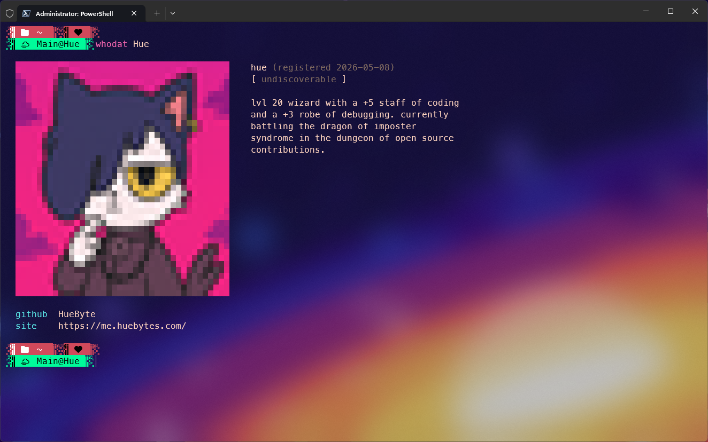

<p align="center">
  
</p>

<h1 align="center">whodat</h1>

<p align="center">
  <em>a global, public registry of identities, queryable from your terminal.</em>
</p>

<p align="center">
  <a href="https://github.com/HueByte/whodat/actions/workflows/ci.yml"></a>
  <a href="https://github.com/HueByte/whodat/releases/latest"></a>
  <a href="https://community.chocolatey.org/packages/whodat"></a>
  
  <a href="LICENSE"></a>
</p>

---

## What is this?

A namespace. You claim a handle, optionally drop a blurb, an avatar, and some metadata. Anyone with the CLI can `whodat <handle>` and see your card, rendered right in the terminal with full-color block-character ASCII art for avatars.

No feeds. No follows. No engagement metrics. No "Stories". Just `name → blurb` lookups, like a phonebook for the internet.

<p align="center">
  
</p>

## Table of Contents

- [Install](#install)
- [Update](#update)
- [Quick start](#quick-start)
- [Commands](#commands)
- [Profile file](#profile-file)
- [Configuration](#configuration)
- [Self-hosting](#self-hosting)
- [Documentation](#documentation)
- [Building from source](#building-from-source)
- [License](#license)

## Install

**Windows (Chocolatey):**

```powershell
choco install whodat
```

**macOS / Linux (Homebrew, formula by URL):**

```bash
brew install --formula https://raw.githubusercontent.com/HueByte/whodat/master/packaging/homebrew/whodat.rb
```

**Manual:** grab a zip/tar.gz from [Releases](https://github.com/HueByte/whodat/releases) and drop the binary anywhere on your `$PATH`.

**From source:**

```bash
cargo install --path src/cli
```

## Update

If you installed via a package manager:

```powershell
choco upgrade whodat
```

```bash
brew upgrade --formula https://raw.githubusercontent.com/HueByte/whodat/master/packaging/homebrew/whodat.rb
```

If you installed manually (not via choco or brew), use the built-in updater:

```bash
whodat update --check     # see if a newer release exists
whodat update             # download + replace in place
```

`whodat update` pulls the latest GitHub Release, picks the asset matching your platform, verifies the SHA256, and atomically replaces the running binary. Works on linux, macOS, and Windows across x64 / arm64.

> If you installed via choco or brew, prefer the package-manager upgrade so its bookkeeping stays in sync. `whodat update` will still swap the binary in place, but the package manager won't know about it.

## Quick start

```bash
# 1. Claim a handle (with GitHub OAuth - opens the browser, paste the code)
whodat register Hue --github

# 2. Look anyone up
whodat Hue

# 3. Update your blurb later
whodat set --text "currently shipping"

# 4. See your own card (auth-checked)
whodat me
```

Or with a password instead of GitHub:

```bash
whodat register Hue --text "..." --avatar ./me.jpg
# prompts: password / confirm
```

Result of `whodat Hue` (after the above):

<p align="center">
  
</p>

## Commands

```text
whodat <handle>                  Look up a handle (alias for `lookup`)
whodat lookup <handle>           Same, public, no auth needed
whodat register <handle> [...]   Claim a handle (password OR --github)
whodat login [--github]          Re-authenticate on this machine
whodat me                        Show your own entry (auth-checked)
whodat set [...]                 Update text, avatar, metadata
whodat hide                      Make profile 404 to public lookups
whodat unhide                    Reverse `hide`
whodat discoverable              Allow `whodat random` to surface you
whodat undiscoverable            Opt out of random discovery
whodat alias add <name>          Add a handle alias (max 5)
whodat alias rm <name>           Remove an alias
whodat alias clear               Drop all aliases
whodat delete [--yes]            Delete your registration
whodat update [--check]          Self-update from the latest GitHub Release
```

Shared flags for `register` / `set`:

| Flag | Purpose |
|---|---|
| `--text "..."` | Free-text blurb (≤ 280 chars) |
| `--avatar <path or URL>` | Image, converted to colored ASCII before upload |
| `--meta key=value` | Repeatable metadata pair, e.g. `--meta github=HueByte` |
| `--profile <file.json>` | Load text/avatar/metadata from JSON |
| `--github` | (register only) Use GitHub device flow instead of password |

Full reference with examples: [`docs/cli.md`](docs/cli.md).

## Profile file

Both `register` and `set` accept `--profile <path>`. Keep your profile in dotfiles, share it across machines:

```json
{
  "text": "building things, mass graveyard of side projects",
  "avatar": "./me.jpg",
  "metadata": {
    "github": "HueByte",
    "site": "huebyte.dev"
  }
}
```

```bash
whodat register Hue --github --profile ~/dotfiles/whodat.json
whodat set --profile ~/dotfiles/whodat.json --text "blurb override just this run"
```

Per-flag args (`--text`, `--avatar`, `--meta`) win on conflicts.

## Configuration

By default the CLI talks to `https://whoisdat.dev`. Override per-invocation with `--api`, or set an env var:

```bash
export WHODAT_API=https://my-self-hosted.example.com
```

Session token (saved after `register` / `login`):

| Platform | Path |
|---|---|
| Linux | `~/.config/whodat/session.json` |
| macOS | `~/Library/Application Support/whodat/session.json` |
| Windows | `%APPDATA%\whodat\session.json` |

## Self-hosting

Want your own registry? whodat is fully open source and self-hostable. The server is an ASP.NET Core 10 + SQLite app behind nginx, shipped as a multi-arch Docker image at `ghcr.io/huebyte/whodat-api`. One-line bring-up:

```bash
git clone https://github.com/HueByte/whodat
cd whodat
cp .env.example .env
docker compose up -d
```

Full hosting walkthrough (env vars, GitHub OAuth setup, optional Infisical secret store, TLS): [`docs/deployment.md`](docs/deployment.md).

## Documentation

Deeper docs live in [`docs/`](docs/):

- [Usage](docs/usage.md) - every command with runnable examples
- [Architecture](docs/architecture.md)
- [CLI reference](docs/cli.md)
- [HTTP API](docs/api.md)
- [Deployment](docs/deployment.md)
- [Development](docs/development.md)

## Building from source

```bash
# CLI
cargo build --release --manifest-path src/cli/Cargo.toml
# binary at: src/cli/target/release/whodat
```

Server build, dev loop, release pipeline notes are in [`docs/development.md`](docs/development.md).

## License

[MIT](LICENSE) © HueByte
