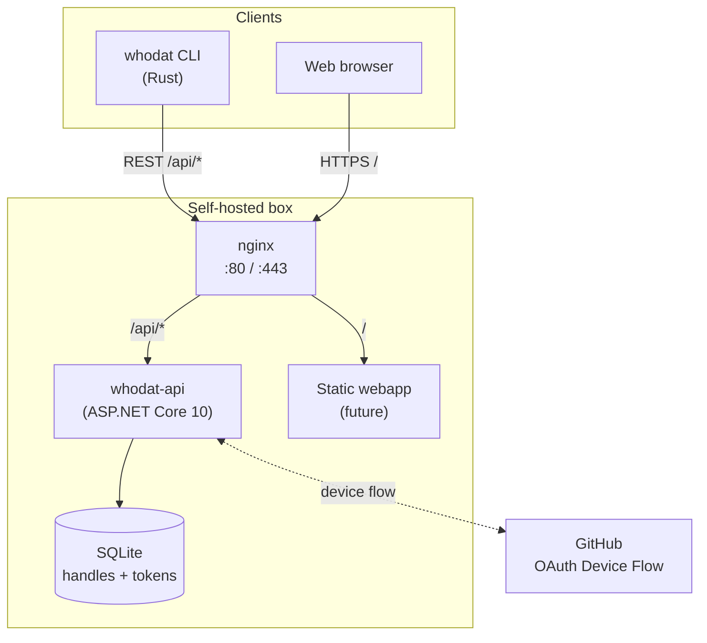

# whodat

<p align="center">
  <em>a global, public registry of identities — queryable from your terminal.</em>
</p>

<p align="center">
  <a href="https://github.com/HueByte/whodat/actions/workflows/ci.yml"></a>
  <a href="https://github.com/HueByte/whodat/releases/latest"></a>
  <a href="https://community.chocolatey.org/packages/whodat"></a>
  <a href="https://github.com/HueByte/whodat/pkgs/container/whodat-api"></a>
  
  
  <a href="LICENSE"></a>
</p>

---

## What is this?

A namespace. You claim a handle, optionally drop a blurb, an avatar, and some metadata. Anyone with the CLI can `whodat <handle>` and see your card — rendered right in the terminal, with full-color block-character ASCII art for avatars.

No feeds. No follows. No engagement metrics. No "Stories". Just `name → blurb` lookups, like a phonebook for the internet.

```text
$ whodat sleepless

  ▀▀▄▄▀▀▀▀▄▄
  ▀░▀▄▀▄░▀▄░     sleepless (registered 2026-05-08)
  ▄▀░░░░░▄▀▄
  ░▀▀▀▀▀▀░░░     building things, mass graveyard of side projects.

                 github       HueByte
                 site         huebyte.dev
```

## What you get

### CLI client (Rust)

- **One binary, zero deps** — single static executable, install via Chocolatey, Homebrew, or grab a release zip
- **Stupidly simple** — `whodat <handle>` and you're done. Five subcommands total.
- **Image → ANSI ASCII** — paste a path or URL, the client renders it as 24-bit colored block characters before upload. The server only ever stores text.
- **Two auth options** — password (one HTTP call) or GitHub OAuth device flow (paste a code in the browser, no callback URL nonsense)
- **Local-only token** — auth lives at `~/.config/whodat/session.json` (or `%APPDATA%\whodat\` on Windows)

### Registry API (ASP.NET Core 10)

- **Self-hostable** — `docker compose up -d` and you're done
- **SQLite for storage** — single file, easy to back up, WAL-mode for concurrent reads
- **Public read, authed writes** — bearer-token middleware, argon… ok BCrypt for passwords
- **GitHub device-flow OAuth** — no client secret needed, ClientId is enough
- **Serilog** — Console + rolling file sink, request logging, real client IPs via `X-Forwarded-For`
- **Healthcheck** — `/api/health` for container probes
- **nginx in front** — TLS termination + static webapp slot baked into the compose file

## Architecture



## Install the CLI

**Windows (Chocolatey):**

```powershell
choco install whodat
```

**macOS / Linux (Homebrew, formula-from-URL):**

```bash
brew install --formula https://raw.githubusercontent.com/HueByte/whodat/master/packaging/homebrew/whodat.rb
```

**Manual:** grab a release zip from [Releases](https://github.com/HueByte/whodat/releases) — single static binary, drop it on your `$PATH`.

**From source:**

```bash
cargo install --path src/cli
```

### Updating

Package-manager users:

```powershell
choco upgrade whodat       # Windows
```

```bash
brew upgrade --formula https://raw.githubusercontent.com/HueByte/whodat/master/packaging/homebrew/whodat.rb   # macOS / Linux
```

Manual install? The CLI updates itself:

```bash
whodat update --check      # see if a newer release exists
whodat update              # download + replace in place
```

`whodat update` pulls the latest GitHub Release, picks the asset matching your platform, verifies the SHA256, and atomically replaces the running binary. Works on all targets (linux/macOS/windows × x64/arm64). Re-run `whodat --version` to confirm the new build.

## CLI usage

```text
whodat <handle>                       # Look up a handle
whodat register <handle> [flags]      # Claim a handle
whodat set [flags]                    # Update your entry
whodat me                             # Show your own entry
whodat delete                         # Remove your registration
```

Shared flags for `register` / `set`:

| Flag | Purpose |
|---|---|
| `--text "..."` | Free-text blurb (≤ 280 chars) |
| `--avatar <path or url>` | Image source — converted to colored ASCII before upload |
| `--meta key=value` | Repeatable metadata pair, e.g. `--meta github=HueByte` |
| `--github` | (register only) Use GitHub device flow instead of password |

By default the CLI talks to `https://whoisdat.dev`. Override with `--api <url>` or `WHODAT_API=<url>`.

### Profile file (`--profile profile.json`)

Both `register` and `set` accept a `--profile <path>` flag that loads `text`, `avatar`, and `metadata` from a single JSON file. Per-flag CLI args (`--text`, `--avatar`, `--meta`) still win over the file. Useful for keeping your profile in dotfiles or sharing across machines.

```json
{
  "text": "building things, mass graveyard of side projects",
  "avatar": "./me.jpg",
  "metadata": {
    "github": "HueByte",
    "site": "huebyte.dev"
  }
}
```

```bash
whodat register sleepless --github --profile ~/dotfiles/whodat.json
whodat set --profile ~/dotfiles/whodat.json --text "blurb override just this run"
```

### Examples

```bash
# Password registration with avatar from a local image
whodat register sleepless \
  --text "building things, mass graveyard of side projects" \
  --avatar ./me.jpg \
  --meta github=HueByte \
  --meta site=huebyte.dev

# GitHub OAuth registration — opens browser, prints the user code
whodat register sleepless --github --text "..."

# Look someone up
whodat sleepless

# Update your blurb only
whodat set --text "currently: shipping"
```

## Host your own registry

The compose file ships with both the API and an nginx front-door. Put your own TLS in front (or terminate in nginx) and you're done.

```bash
git clone https://github.com/HueByte/whodat
cd whodat
cp .env.example .env       # set WHODAT_PORT and (optionally) GITHUB_CLIENT_ID
docker compose up -d
```

Pre-built images: [`ghcr.io/huebyte/whodat-api`](https://github.com/HueByte/whodat/pkgs/container/whodat-api) — `linux/amd64` and `linux/arm64`.

### Configuration

| Variable | Default | Purpose |
|---|---|---|
| `WHODAT_PORT` | `8080` | Public host port nginx binds to |
| `GITHUB_CLIENT_ID` | *(unset)* | OAuth App client ID — leave blank to disable `/api/auth/github/*` (returns 503) |
| `Whodat__DbPath` | `/data/whodat.db` | Inside the API container; mounted on `whodat-data` volume |
| `ASPNETCORE_ENVIRONMENT` | `Production` | Set to `Development` to expose `/openapi/*` |

### Secrets via Infisical (optional)

The API can pull its config from an [Infisical](https://infisical.com) project at startup instead of (or alongside) the env-var path. Set `INFISICAL_ENABLED=true` in `.env` plus the four required fields:

| Variable | What it is |
|---|---|
| `INFISICAL_PROJECT_ID` | Project ID from the Infisical UI |
| `INFISICAL_ENVIRONMENT` | Environment slug — `dev` / `staging` / `prod` |
| `INFISICAL_CLIENT_ID` | Machine identity Client ID (Universal Auth) |
| `INFISICAL_CLIENT_SECRET` | Machine identity Client Secret |

**Naming convention:** secret keys in Infisical use `__` for nesting, the same way ASP.NET Core treats env vars. So a secret named `GitHub__ClientId` in Infisical populates `Configuration["GitHub:ClientId"]` automatically — no code changes needed.

**Priority:** Infisical is added last in the configuration chain, so its values override `appsettings.json` and environment variables. Use command-line args for emergency overrides.

If `INFISICAL_ENABLED=false` (the default), the provider does nothing and existing env-var-based config keeps working.

### GitHub OAuth setup (optional)

1. <https://github.com/settings/developers> → New OAuth App
2. Toggle **Enable Device Flow** (this is the actual switch — without it, `/start` returns 502)
3. Copy the **Client ID** into `.env` as `GITHUB_CLIENT_ID`
4. The `Authorization callback URL` field is required by GitHub's form but device flow never uses it — put any valid URL

The client secret is **not needed** for device flow.

### Upgrading

Tags `latest` and `vX.Y.Z` are published on every release.

```bash
docker compose pull
docker compose up -d
```

SQLite data lives in the `whodat-data` named volume — survives restarts and image upgrades.

## Anti-squatting & rate limiting

> **Status:** roadmap. The current MVP trusts callers; abuse-resistance lands before the public registry opens.

Planned levers:

- One handle per GitHub account (already enforced when GitHub OAuth is used)
- Per-IP cooldown on registration
- Per-token rate limit on mutations
- Per-IP rate limit on lookups (to prevent enumeration)
- Reserved-handle list

## Repo layout

```text
whodat/
  src/
    cli/          # Rust CLI (clap, reqwest, image)
    api/          # ASP.NET Core API + Dockerfile
  infra/
    nginx/        # default.conf + static html slot
  packaging/
    choco/        # Chocolatey nuspec + install scripts
    homebrew/     # Generated formula (regenerated by release workflow)
  .github/
    workflows/    # ci, docker, release, release-checklist
  docker-compose.yml
  .env.example
```

## Building from source

The API's `appsettings.json` is **gitignored** so contributors can't leak local tweaks. Copy the committed example before running locally:

```bash
cp src/api/Whodat.Api/appsettings.json.example src/api/Whodat.Api/appsettings.json
```

The Dockerfile already does this fallback automatically — `docker compose up` works on a clean clone with no extra steps.

```bash
# Rust client
cargo build --release --manifest-path src/cli/Cargo.toml

# .NET API
dotnet build src/api/Whodat.slnx

# Full stack via docker-compose
docker compose up -d --build
```

## Releases

Pushing to `master` with a bumped `version` field in [src/cli/Cargo.toml](src/cli/Cargo.toml) triggers, in order:

1. **CI** — Rust fmt + clippy + tests + .NET build
2. **Docker** — multi-arch image to `ghcr.io/huebyte/whodat-api:latest` + `:vX.Y.Z`
3. **Release** — cross-builds the CLI for win/linux/mac × x64/arm64, creates a GitHub Release with the binaries, publishes the Chocolatey package, and regenerates the Homebrew formula

PRs targeting `master` are gated by the **Release Checklist** workflow which fails if the version wasn't bumped.

## License

[MIT](LICENSE) © HueByte
