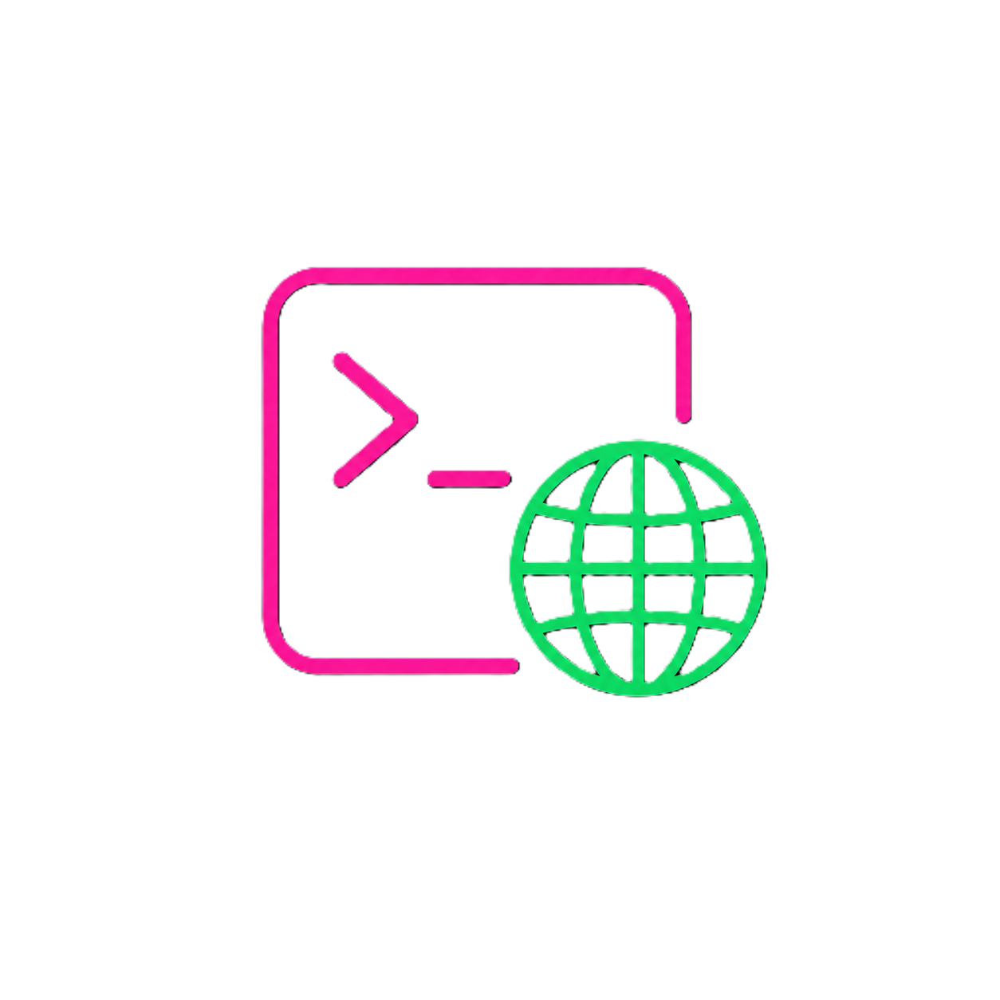

# whodat docs

<p align="center">
  
</p>

Deep-dive documentation for [whodat](../README.md). Each page is focused on one slice of the system; pick whichever matches what you're trying to do.

## Pages

| Page | What it covers |
|---|---|
| [Usage](usage.md) | Every command with runnable examples and expected output, common multi-step flows |
| [Architecture](architecture.md) | How the pieces fit together - CLI, nginx, API, SQLite, Infisical, GitHub OAuth |
| [CLI reference](cli.md) | Every `whodat` command, the `profile.json` format, env vars, where the session token lives |
| [HTTP API](api.md) | Every endpoint, request/response shapes, bearer-token auth, error codes |
| [Deployment](deployment.md) | Self-hosting via Docker compose, nginx in front, GitHub OAuth setup, Infisical secret pull |
| [Development](development.md) | Local dev loop, release pipeline, EF migrations, adding endpoints/commands |

## Quick paths through the docs

- **"I want to install and use the CLI"** → [README install section](../README.md#install-the-cli) → [CLI reference](cli.md)
- **"I want to host my own registry"** → [Deployment](deployment.md) → [Architecture](architecture.md) for context
- **"I want to understand how it's built"** → [Architecture](architecture.md) → [HTTP API](api.md)
- **"I want to contribute"** → [Development](development.md) → [Architecture](architecture.md)

## Project structure (from the repo root)

```text
whodat/
  src/
    cli/         Rust CLI - clap, reqwest, image ascii rendering, self-update
    api/         ASP.NET Core 10 API - Identity, EF Core SQLite, Infisical
  infra/
    nginx/       reverse proxy config + static webapp slot
  packaging/
    choco/       Chocolatey nuspec + install scripts
    homebrew/    Homebrew formula (regenerated on each release)
  .github/
    workflows/   CI, Docker, Release, Release-Checklist, Choco-publish
  docs/          ← you are here
  assets/        logo + screenshots used in the README
```
