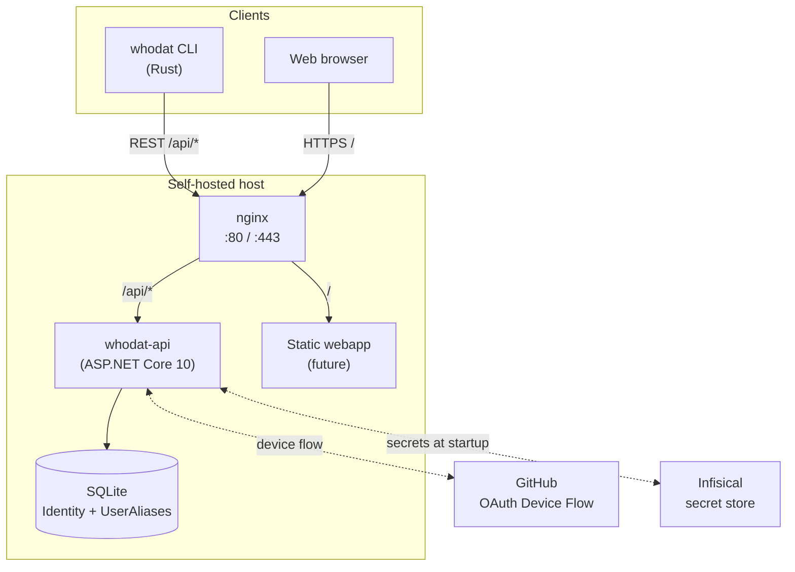
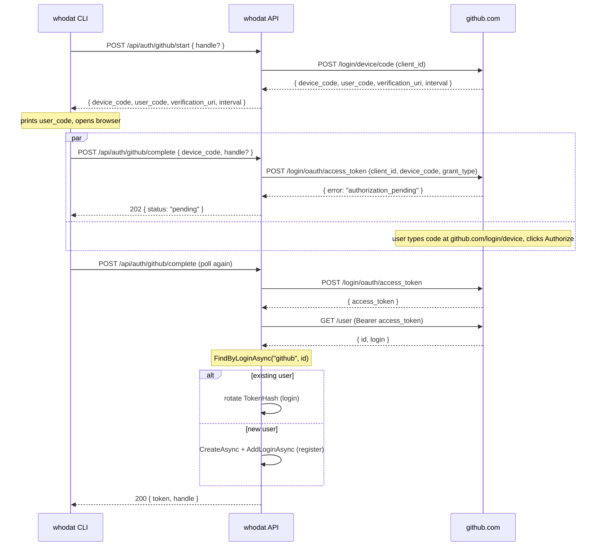

# Architecture

The whole system in one picture:



## Components

### CLI client - `src/cli/` (Rust)

Single static binary. No runtime, no installer. Pure-Rust deps so it cross-compiles to all five shipping targets without C toolchain headaches:

- **clap** - arg parsing, subcommand dispatch
- **reqwest** (rustls + blocking) - HTTPS to the API and to GitHub
- **image** (default features off) - PNG/JPEG/GIF/WEBP decoders for avatar rendering
- **textwrap** - wrap blurb text in the right column of the side-by-side render
- **owo-colors** - terminal ANSI colors
- **rpassword** - masked password prompts
- **dirs** - locates `~/.config/whodat/session.json` (or the Windows equivalent)
- **webbrowser** - opens `github.com/login/device` for OAuth
- **self_update** - implements `whodat update` against the GitHub Releases API

The CLI talks to the API using a long-lived bearer token, stored locally at:

| Platform | Path |
|---|---|
| Linux | `~/.config/whodat/session.json` |
| macOS | `~/Library/Application Support/whodat/session.json` |
| Windows | `%APPDATA%\whodat\session.json` |

### Reverse proxy - `infra/nginx/`

nginx terminates the public request and routes:

- `/api/*` → forwards to the API container (no path rewrite - the API serves its endpoints under `/api` natively, see [routing convention](#why-the-api-mounts-under-api))
- `/nginx-health` → returns 200, used as the proxy's own healthcheck
- `/*` → serves static files from `/usr/share/nginx/html` (placeholder webapp for now; drop a real build in there later)

`X-Forwarded-For` and `X-Forwarded-Proto` are honored by the API via `UseForwardedHeaders`, so Serilog logs the real client IP, not the nginx container's internal one.

### API - `src/api/Whodat.Api/` (.NET 10)

ASP.NET Core minimal-API style. The route group lives at `/api`:

```
GET    /api/health
GET    /api/u/{handle}                public, also resolves aliases
POST   /api/register                  password registration
GET    /api/u/me                      bearer-required
PUT    /api/u/me                      bearer-required, partial update
DELETE /api/u/me                      bearer-required
POST   /api/auth/github/start         device-flow start
POST   /api/auth/github/complete      polled by CLI; register-or-login
```

See [HTTP API](api.md) for the full request/response shapes.

#### Auth model

ASP.NET Core Identity provides the user store (`AspNetUsers` and friends) and password hashing (PBKDF2). What's *custom* is the bearer-token mechanism:

- We store a `TokenHash` (SHA256) column directly on the user row, indexed
- A custom [`BearerTokenHandler`](../src/api/Whodat.Api/Auth/BearerTokenHandler.cs) reads `Authorization: Bearer <token>`, hashes it, looks the user up, builds a `ClaimsPrincipal`
- Endpoints gated with `.RequireAuthorization()` resolve the user via `userManager.GetUserAsync(ctx.User)`

This is the **personal access token model** (cf. GitHub PATs) - issue once at register/login, persist forever, revoke by deleting the user or rotating via re-login. It's deliberately simple compared to JWT + refresh-token flows because the consumer is a CLI, not a web session.

#### GitHub OAuth - device-code flow

Device flow exists specifically for clients that can't host a redirect URL (CLIs, IoT devices, smart TVs). The dance:



The `client_secret` is **not** used - device flow on OAuth Apps only needs the `client_id`. The "Authorization callback URL" field in the OAuth App settings is required by GitHub's form but never invoked.

### Database - SQLite + EF Core

One file, WAL-mode for concurrent reads. Schema:

```
AspNetUsers              ← Identity-managed user (handle, PasswordHash, TokenHash, IsHidden, RandomVisible, …)
AspNetUserLogins         ← maps GitHub IDs to AspNetUsers
AspNetUserClaims         ← unused for now, future role/permission features
AspNetUserTokens         ← unused
AspNetRoles, AspNetUserRoles  ← unused
UserAliases              ← FK to AspNetUsers, unique-indexed Alias column, max 5 per user
__EFMigrationsHistory    ← tracks which migrations have been applied
```

Migrations are checked into [`src/api/Whodat.Api/Data/Migrations/`](../src/api/Whodat.Api/Data/Migrations/) and applied on container start via `db.Database.Migrate()`. See [Development → Migrations](development.md#schema-migrations).

### Configuration & secrets - Infisical

The API uses a custom [`InfisicalConfigurationProvider`](../src/api/Whodat.Api/Infisical/InfisicalConfigurationProvider.cs) plugged into ASP.NET's configuration chain. When `Infisical:Enabled=true`, it pulls every secret under the configured project/env/path at startup and merges them into `IConfiguration`, with the env-var convention `__` → `:` (so `GitHub__ClientId` in the vault populates `Configuration["GitHub:ClientId"]`).

Bootstrap creds (`Infisical:ClientId` / `:ClientSecret`) live on the host (env vars / systemd EnvironmentFile / Docker secrets - whichever you prefer); everything else can move to Infisical.

See [Deployment → Infisical](deployment.md#infisical-secret-store) for the wiring.

## Why the API mounts under `/api`

Internally, every endpoint is registered under `app.MapGroup("/api")`. This means:

- External URL: `https://whoisdat.dev/api/u/sleepless`
- Internal API path: `/api/u/sleepless`
- nginx `proxy_pass http://whodat_api;` (no rewrite)

The alternative - endpoints at `/u/sleepless` with nginx stripping `/api/` via `proxy_pass http://upstream/;` - was simpler from one angle but caused two papercuts:

1. Internal docs/OpenAPI showed paths that didn't match production
2. Direct connections (debugging via `curl localhost:5099`) needed different paths than production

Mounting under `/api` everywhere keeps the addressing consistent regardless of whether you're hitting nginx or the API directly.

## Side-by-side render

The CLI's `render::entry()` produces the layout you see in the README screenshot:

- **Avatar** on the left, fixed at 40-char visible width (block characters, 24-bit ANSI color)
- **Header + wrapped text** on the right, wrapped to 60 chars
- **Aliases** shown under the header as `also: foo, bar`
- **Visibility flags** as `[ hidden / undiscoverable ]` when set
- **Metadata table** at the bottom, key/value with cyan keys

When the entry has no avatar, the renderer falls back to a single-column layout - header, then text, then metadata.

The avatar pixel-doubling trick: each terminal row encodes **two image rows** by using the upper-half-block character `▀` with foreground = top pixel, background = bottom pixel. Doubles the vertical resolution per terminal line.
